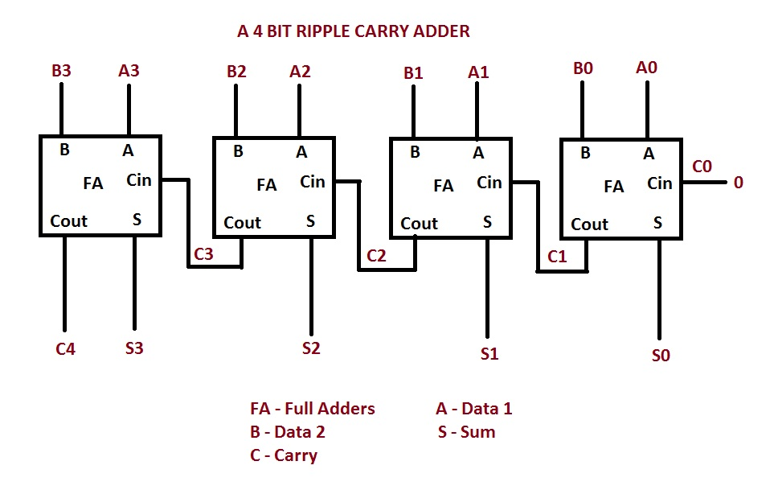

# RTL2GDS-4bit-Ripple-Carry-Adder
In this project, I have demonstrated the complete ASIC physical design implementation of a 4-bit Ripple Carry Adder using the SKY130 open-source PDK and the OpenLane digital design from RTL design → synthesis → floorplanning → placement → routing → DRC/LVS → final GDSII tapeout-ready layout.
## 4-Bit Ripple Carry Adder
A Ripple Carry Adder (RCA) is a combinational digital circuit used to perform binary addition of multi-bit numbers. It is constructed by cascading multiple Full Adders, where the carry output of one stage becomes the carry input of the next stage. In a 4-bit Ripple Carry Adder, four full adders are connected in series to add two 4-bit binary numbers along with an optional carry input.

<br>
The 4-bit Ripple carry Adder adds 4-bit numbers A(A3 A2 A1 A0) and B(B3 B2 B1 B0) with an input carry Cin and produces sum S(S3 S2 S1 S0) and a output carry Cout. For this, four Full adders are used.
### FULL ADDER LOGIC

Sum logic: ```S = A ⊕ B ⊕ Cin```<br>
Carry logic: ```Cout = AB + BCin + ACin```

For the Carry Logic, The carry output of the full adder can be written as <br>
```Cout = AB + BCin + ACin``` or ```Cout = AB + Cin(A ⊕ B)```<br>
Both expressions are logically equivalent. In ASIC implementations, the majority form AB + BCin + ACin is often preferred because it maps efficiently to majority gates (MAJ3) available in standard cell libraries such as SKY130. XOR gates are relatively expensive in hardware compared to simple AND/OR combinations. Thus the majority form can sometimes be simpler at the transistor level.
| A | B | Cin | Sum (S) | Carry Out (Cout) |
| - | - | --- | ------- | ---------------- |
| 0 | 0 | 0   | 0       | 0                |
| 0 | 0 | 1   | 1       | 0                |
| 0 | 1 | 0   | 1       | 0                |
| 0 | 1 | 1   | 0       | 1                |
| 1 | 0 | 0   | 1       | 0                |
| 1 | 0 | 1   | 0       | 1                |
| 1 | 1 | 0   | 0       | 1                |
| 1 | 1 | 1   | 1       | 1                |

## Contents
- [1. Tools and PDK](#1-Tools-and-PDK)
  - [1.1 Icarus Verilog](#11-Icarus-Verilog)
  - [1.2 GTK Wave](#12-GTKwave)
  - [1.3 OpenLane](#13-OpenLane)
  - [1.4 Yosys](#14-Yosys)
  - [1.5 Yosys](#15-Yosys)
  - [1.6 Magic](#16-Magic)
  - [1.7 Netgen](#17-Netgen)
  - [1.8 Skywater Technology](#18-Skywater-Technology)
- [2. Design Specifications](#2-Design-Specifications)
- [3. RTL Design and Simulations](#3-RTL-Design)

## 1. Tools and PDK
### 1.1 Icarus Verilog


[iverilog](https://steveicarus.github.io/iverilog/) is an open-source Verilog simulation and compilation tool used to verify RTL designs. It compiles Verilog code into executable simulation files and works with the vvp runtime to simulate digital circuits and generate waveform outputs (e.g., VCD files) for debugging and functional verification.

### 1.2 GTK Wave


[gtkwave](https://gtkwave.sourceforge.net/) is an open-source waveform viewer used to analyze digital simulation results. It reads waveform files such as VCD (Value Change Dump) generated during simulation and provides a graphical interface to inspect signal transitions, timing relationships, and logic behavior, helping designers debug and verify RTL designs.

### 1.3 OpenLane
[openLane](https://openlane2.readthedocs.io/en/latest/index.html) is an open-source automated digital ASIC design flow that converts synthesized RTL designs into a physical chip layout. It integrates tools such as Yosys, OpenROAD, Magic, Netgen, and KLayout to perform synthesis, floorplanning, placement, routing, and verification, enabling a complete RTL-to-GDSII implementation using open PDKs like Sky130.

### 1.4 Yosys


[yosys](https://yosyshq.net/yosys/) is an open-source synthesis framework used to convert RTL designs written in Verilog into gate-level netlists. It performs tasks such as logic synthesis, optimization, and technology mapping to standard cell libraries, producing a netlist that can be used for further physical design stages like placement and routing.

### 1.5 OpenROAD


[openROAD](https://openroad.readthedocs.io/en/latest/) is an open-source automated place-and-route tool used in digital ASIC design. It takes a synthesized gate-level netlist and performs physical design steps such as floorplanning, placement, clock tree synthesis, routing, and timing optimization to generate the physical layout of the chip.

### 1.6 Magic


[Magic](http://opencircuitdesign.com/magic/) is an open-source layout editor used for physical design of integrated circuits. In this project, Magic is employed to create the physical layout of the CMOS inverter using design rules provided by the SKY130 PDK. It supports design rule checking (DRC) to ensure layout correctness and allows extraction of parasitic components from the layout. The extracted layout information is used for post-layout simulation, enabling evaluation of the impact of parasitic capacitances and resistances on inverter performance. Magic plays a key role in bridging schematic-level design and physical implementation in the CMOS design flow.

### 1.7 Netgen


[Netgen](http://opencircuitdesign.com/netgen/) is an open-source verification tool used for layout versus schematic (LVS) checking in integrated circuit design flows. In this project, Netgen is used to compare the netlist extracted from the physical layout with the netlist generated from the schematic to ensure logical equivalence between the two representations. This verification step confirms that the implemented layout correctly reflects the intended circuit design. Netgen thereby ensures design correctness before post-layout simulation and helps identify connectivity or device mismatch issues in the CMOS inverter layout.

### 1.8 SkyWater Technology


[SkyWater](https://www.skywatertechnology.com/technology-and-design-enablement/) is an open-source CMOS technology kit based on a 130 nm process, providing device models, design rules, and layout information required for integrated circuit design. In this project, the SKY130 PDK is used to access accurate NMOS and PMOS transistor models for schematic-level simulation and physical design. The PDK supplies technology-specific parameters for circuit simulation, layout rule checking, and parasitic extraction, enabling consistent pre-layout and post-layout analysis. Its open availability makes it suitable for academic research and educational CMOS design projects.

## 2. Design Specifications
| Parameter | Value |
|----------|------|
| Architecture | Ripple Carry Adder |
| Bit Width | 4 |
| Technology | SKY130 |
| Standard Cell Library | sky130_fd_sc_hd |
| HDL | Verilog |
| Flow | RTL → GDSII |

## 3. RTL Design and Simulations
The design is implemented in Verilog using hierarchical modules.

Modules:

* Full Adder  (```full_adder.v```)
* Top Module: 4-bit Ripple Carry Adder (```rca_4bit.v```)

I have created a testbench file ```tb_rca_4bit.v``` for the functional verificataion of the design. Test cases include multiple combinations of inputs to validate sum output and carry propagation. The outputs for the simulation are shown below:
