# RTL2GDS-4bit-Ripple-Carry-Adder
In this project, I have demonstrated the complete ASIC physical design implementation of a 4-bit Ripple Carry Adder using the SKY130 open-source PDK and the OpenLane digital design from RTL design → synthesis → floorplanning → placement → routing → DRC/LVS → final GDSII tapeout-ready layout.
## 4-Bit Ripple Carry Adder
A Ripple Carry Adder (RCA) is a combinational digital circuit used to perform binary addition of multi-bit numbers. It is constructed by cascading multiple Full Adders, where the carry output of one stage becomes the carry input of the next stage. In a 4-bit Ripple Carry Adder, four full adders are connected in series to add two 4-bit binary numbers along with an optional carry input.

<br>
The 4-bit Ripple carry Adder adds 4-bit numbers A(A3 A2 A1 A0) and B(B3 B2 B1 B0) with an input carry Cin and produces sum S(S3 S2 S1 S0) and a output carry Cout. For this, four Full adders are used.
### FULL ADDER LOGIC

Sum logic: ```S = A ⊕ B ⊕ Cin```<br>
Carry logic: ```Cout = AB + BCin + ACin```

For the Carry Logic, The carry output of the full adder can be written as <br>
```Cout = AB + BCin + ACin``` or ```Cout = AB + Cin(A ⊕ B)```<br>
Both expressions are logically equivalent. In ASIC implementations, the majority form AB + BCin + ACin is often preferred because it maps efficiently to majority gates (MAJ3) available in standard cell libraries such as SKY130. XOR gates are relatively expensive in hardware compared to simple AND/OR combinations. Thus the majority form can sometimes be simpler at the transistor level.
| A | B | Cin | Sum (S) | Carry Out (Cout) |
| - | - | --- | ------- | ---------------- |
| 0 | 0 | 0   | 0       | 0                |
| 0 | 0 | 1   | 1       | 0                |
| 0 | 1 | 0   | 1       | 0                |
| 0 | 1 | 1   | 0       | 1                |
| 1 | 0 | 0   | 1       | 0                |
| 1 | 0 | 1   | 0       | 1                |
| 1 | 1 | 0   | 0       | 1                |
| 1 | 1 | 1   | 1       | 1                |

## Contents
- [1. Tools and PDK](#1-Tools-and-PDK)
  - [1.1 Icarus Verilog](#11-Icarus-Verilog)
  - [1.2 GTK Wave](#12-GTKwave)
  - [1.3 OpenLane](#13-OpenLane)
  - [1.4 Yosys](#14-Yosys)
  - [1.5 OpenROAD](#15-OpenROAD)
  - [1.6 Magic](#16-Magic)
  - [1.7 Netgen](#17-Netgen)
  - [1.8 Skywater Technology](#18-Skywater-Technology)
- [2. Design Specifications](#2-Design-Specifications)
- [3. RTL Design and Simulations](#3-RTL-Design)
- [4. Synthesis](#4-Synthesis)
- [5. Floorplanning](#5-Floorplanning)
- [6. DRC and LVS](#6-DRC-and-LVS)
- [7. GDSII Generation](#7-GDSII-Generation)

## 1. Tools and PDK
### 1.1 Icarus Verilog


[iverilog](https://steveicarus.github.io/iverilog/) is an open-source Verilog simulation and compilation tool used to verify RTL designs. It compiles Verilog code into executable simulation files and works with the vvp runtime to simulate digital circuits and generate waveform outputs (e.g., VCD files) for debugging and functional verification.

### 1.2 GTK Wave


[gtkwave](https://gtkwave.sourceforge.net/) is an open-source waveform viewer used to analyze digital simulation results. It reads waveform files such as VCD (Value Change Dump) generated during simulation and provides a graphical interface to inspect signal transitions, timing relationships, and logic behavior, helping designers debug and verify RTL designs.

### 1.3 OpenLane
[openLane](https://openlane2.readthedocs.io/en/latest/index.html) is an open-source automated digital ASIC design flow that converts synthesized RTL designs into a physical chip layout. It integrates tools such as Yosys, OpenROAD, Magic, Netgen, and KLayout to perform synthesis, floorplanning, placement, routing, and verification, enabling a complete RTL-to-GDSII implementation using open PDKs like Sky130.

### 1.4 Yosys


[yosys](https://yosyshq.net/yosys/) is an open-source synthesis framework used to convert RTL designs written in Verilog into gate-level netlists. It performs tasks such as logic synthesis, optimization, and technology mapping to standard cell libraries, producing a netlist that can be used for further physical design stages like placement and routing.

### 1.5 OpenROAD


[openROAD](https://openroad.readthedocs.io/en/latest/) is an open-source automated place-and-route tool used in digital ASIC design. It takes a synthesized gate-level netlist and performs physical design steps such as floorplanning, placement, clock tree synthesis, routing, and timing optimization to generate the physical layout of the chip.

### 1.6 Magic


[Magic](http://opencircuitdesign.com/magic/) is an open-source layout editor used for physical design of integrated circuits. In this project, Magic is employed to create the physical layout of the CMOS inverter using design rules provided by the SKY130 PDK. It supports design rule checking (DRC) to ensure layout correctness and allows extraction of parasitic components from the layout. The extracted layout information is used for post-layout simulation, enabling evaluation of the impact of parasitic capacitances and resistances on inverter performance. Magic plays a key role in bridging schematic-level design and physical implementation in the CMOS design flow.

### 1.7 Netgen


[Netgen](http://opencircuitdesign.com/netgen/) is an open-source verification tool used for layout versus schematic (LVS) checking in integrated circuit design flows. In this project, Netgen is used to compare the netlist extracted from the physical layout with the netlist generated from the schematic to ensure logical equivalence between the two representations. This verification step confirms that the implemented layout correctly reflects the intended circuit design. Netgen thereby ensures design correctness before post-layout simulation and helps identify connectivity or device mismatch issues in the CMOS inverter layout.

### 1.8 SkyWater Technology


[SkyWater](https://www.skywatertechnology.com/technology-and-design-enablement/) is an open-source CMOS technology kit based on a 130 nm process, providing device models, design rules, and layout information required for integrated circuit design. In this project, the SKY130 PDK is used to access accurate NMOS and PMOS transistor models for schematic-level simulation and physical design. The PDK supplies technology-specific parameters for circuit simulation, layout rule checking, and parasitic extraction, enabling consistent pre-layout and post-layout analysis. Its open availability makes it suitable for academic research and educational CMOS design projects.

## 2. Design Specifications
| Parameter | Value |
|----------|------|
| Architecture | Ripple Carry Adder |
| Bit Width | 4 |
| Technology | SKY130 |
| Standard Cell Library | sky130_fd_sc_hd |
| HDL | Verilog |
| Flow | RTL → GDSII |

## 3. RTL Design and Simulations
The design is implemented in Verilog using hierarchical modules.

Modules:

* Full Adder  (```full_adder.v```)
* Top Module: 4-bit Ripple Carry Adder (```rca_4bit.v```)

I have created a testbench file ```tb_rca_4bit.v``` for the functional verificataion of the design. Test cases include multiple combinations of inputs to validate sum output and carry propagation. The outputs for the simulation are shown below:
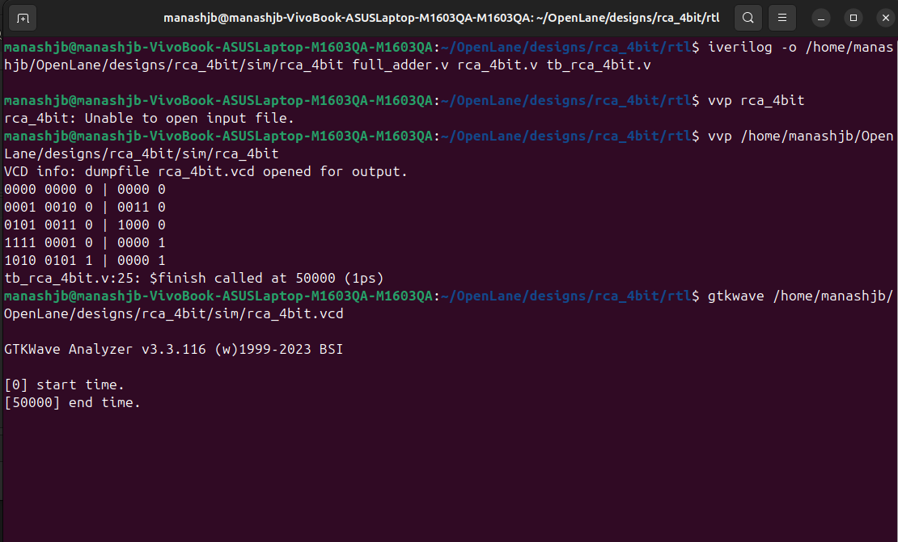<br>
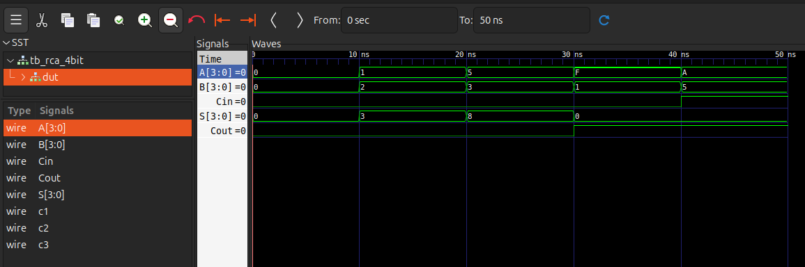<br>

## 4. Synthesis
Logic synthesis is the process of transforming a Register Transfer Level (RTL) description written in a Hardware Description Language (HDL) into a gate-level netlist composed of technology-specific standard cells. The main goals of synthesis are:

1. Functional correctness
2. Technology mapping
3. Optimization for Area, Power and Timing

In this project, synthesis is performed using Yosys, mapping the Verilog implementation of the 4-bit Ripple Carry Adder to cells from the SkyWater SKY130 PDK standard cell library. The resulting gate-level netlist is used as the input for the physical design stages such as floorplanning, placement, and routing.

### Inputs for Synthesis Process
1. High-Level Description (RTL Design)

> This represents the functional description of the digital circuit written using a Hardware Description Language (HDL), such as Verilog. It defines how the circuit should behave logically by specifying the inputs, outputs, and the relationships between them before the design is converted into actual hardware gates.

```full_adder.v```

```rca_4bit.v```

2. Constraints

> Constraints define the design requirements that guide the synthesis and optimization process. These can include timing requirements (such as maximum delay or clock period), area limitations, power limits, and other performance-related specifications.

No explicit constraint file was used in this project. Since the design is a purely combinational circuit, the synthesis was performed without specifying timing constraints. The synthesis tool optimized the design using the default parameters provided by the standard cell library.

3. Library Information

> The standard cell library provides the set of logic gates and digital building blocks that the synthesis tool uses to implement the circuit. It also contains detailed information about each cell, including propagation delay, power consumption, pin characteristics, and physical area. The Liberty (.lib) file belongs to the SKY130 High-Speed Standard Cell Library is used by the synthesis tool to map the RTL design into actual logic gates during technology mapping.

```sky130_fd_sc_hs__tt_025C_1v80.lib```

Commands used in the yosys are:

```tcl
# Step 1: Load the standard cell library
read_liberty -lib /home/manashjb/OpenROAD-flow-scripts/flow/platforms/sky130hs/lib/sky130_fd_sc_hs__tt_025C_1v80.lib

# Step 2: Read RTL Verilog source files
read_verilog ../rtl/full_adder.v
read_verilog ../rtl/rca_4bit.v

# Step 3: Run synthesis
synth -top rca_4bit

# Step 4: Flatten the design hierarchy
flatten

# Step 5: Technology mapping using ABC
abc -liberty /home/manashjb/OpenROAD-flow-scripts/flow/platforms/sky130hs/lib/sky130_fd_sc_hs__tt_025C_1v80.lib

# Step 6: Print synthesis statistics
stat

# Step 7: Write the synthesized gate-level netlist
write_verilog rca_4bit_synth.v

# Step 8: Export the synthesized design in JSON format
write_json rca_4bit_synth.json

#Step 9: Generate GraphViz DOT file
show -format dot -prefix rca_4bit
```
Flattening was used in this design to remove the hierarchical structure created by the four full_adder modules inside the rca_4bit top module. Since the ripple carry adder is a relatively small circuit, flattening the hierarchy simplifies the design by merging all submodules into a single top-level module. This allows the synthesis tool to optimize the logic across module boundaries and generate a netlist that directly contains only SKY130 standard cells. A flattened netlist also makes verification and comparison with the physical layout easier during LVS and helps clearly observe the final gate-level implementation of the circuit.
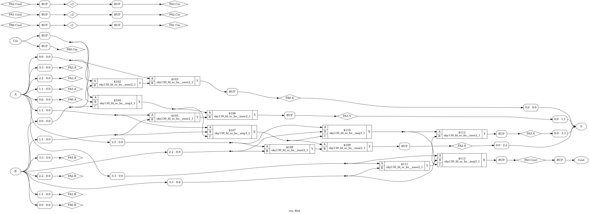<br>

## 5. Floorplanning
Here we go with the physical design, the stage of the ASIC implementation flow where the technology-mapped gate-level netlist is transformed into a physical layout that can be fabricated on silicon. During this stage, standard cells are placed within the chip area and routing resources are allocated to interconnect the cells. Starting with the very important step of Floorplanning.

In the floorplanning, I defined the physical boundaries of the chip layout and determines where standard cells will be placed. Also, establishing the die size, core placement region, and routing margins targeting efficient placement of standard cells and minimum routing congestion.

#### Inputs Required for Floorplanning
1. Synthesized Netlist 
   ```rca_4bit_synth.v```
2. Technology LEF 
   ```sky130_fd_sc_hs.tlef```
   ```sky130_fd_sc_hs_merged.lef```
3. Liberty Timing Library
   ```sky130_fd_sc_hs__tt_025C_1v80.lib```

The following TCL commands are used in OpenROAD to read these input files and to link the design:

```tcl
#Read Netlist and library files
read_verilog ../synth/rca_4bit_synth.v
read_lef sky130_fd_sc_hs.tlef
read_lef sky130_fd_sc_hs_merged.lef
read_liberty sky130_fd_sc_hs__tt_025C_1v80.lib

#Link the Design
link_design rca_4bit
```
Then the chiip dimension and placement regions are specied
```tcl
initialize_floorplan -die_area {0 0 20 20} -core_area {2 2 18 18} -sites "unit"
```
* **Die Area**: The die area represents the total physical area of the chip. It includes everything inside the chip boundary. (0,0)	Lower-left corner of the chip and (20,20)	Upper-right corner of the chip. 
* **Core Area**: The core area is the region inside the die where standard cells are placed. (2,2)	Lower-left corner of the chip and (18,18)	Upper-right corner of the chip.

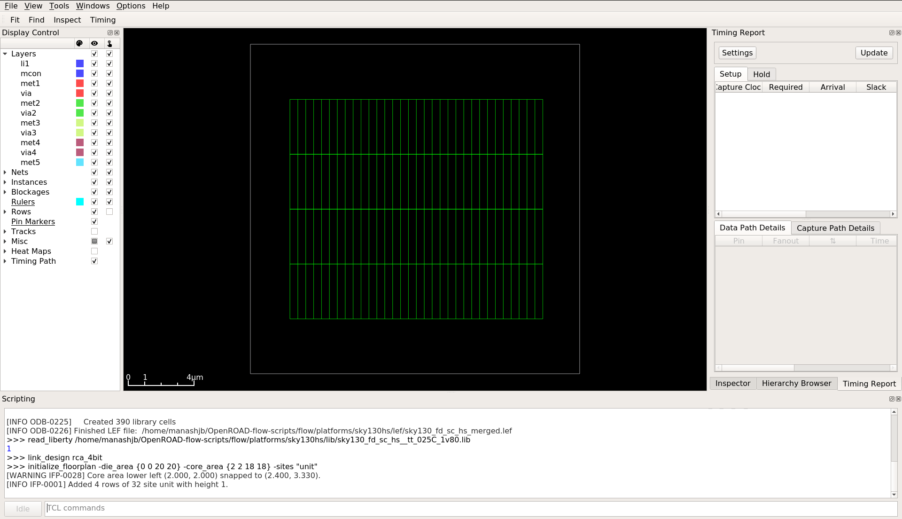<br>
Next step is defining the routing tracks. Routing tracks are regularly spaced horizontal and vertical lines that form a grid across the chip which helps determine the grid locations where metal wires can be placed during routing. The ```make_tracks.tcl``` script automatically generates routing tracks for each metal layer using the technology parameters.
```tcl
source /home/manashjb/OpenROAD-flow-scripts/flow/platforms/sky130hs/make_tracks.tcl
```
The preferred routing directions of each metal layer are defined in the SKY130 technology LEF file (```sky130_fd_sc_hs.tlef```):
| Layer | Type               | Preferred Direction |
| ----- | ------------------ | ------------------- |
| li1   | Local interconnect | horizontal          |
| met1  | Metal 1            | horizontal          |
| met2  | Metal 2            | vertical            |
| met3  | Metal 3            | horizontal          |
| met4  | Metal 4            | vertical            |
| met5  | Metal 5            | horizontal          |

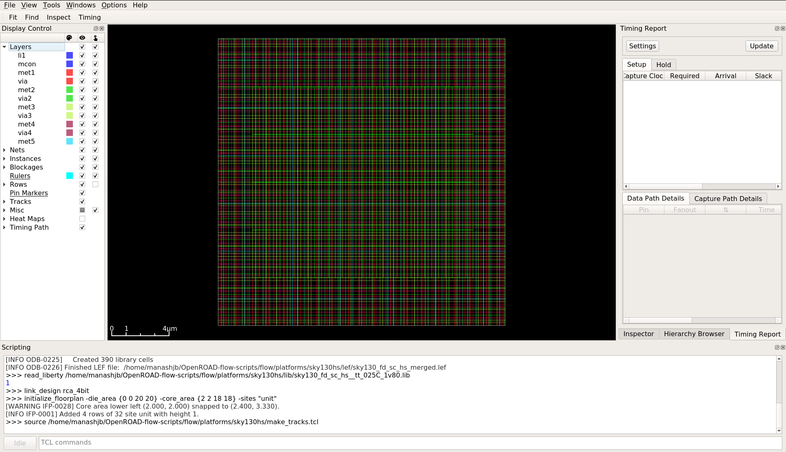<br> 
Tapcells prevent latch-up in CMOS circuits by connecting nwell to VDD and p-substrate to GND. The tapcells provide periodic substrate contacts across the layout. The tapcell used in your design is ```sky130_fd_sc_hs__tapvpwrvgnd_1```. This standard cell includes a well contact, connections to VPWR (VDD) and connections to VGND (GND). The standard cell is part of the SKY130HS standard cell library.
```tcl
tapcell -tapcell_master sky130_fd_sc_hs__tapvpwrvgnd_1 -distance 14
```

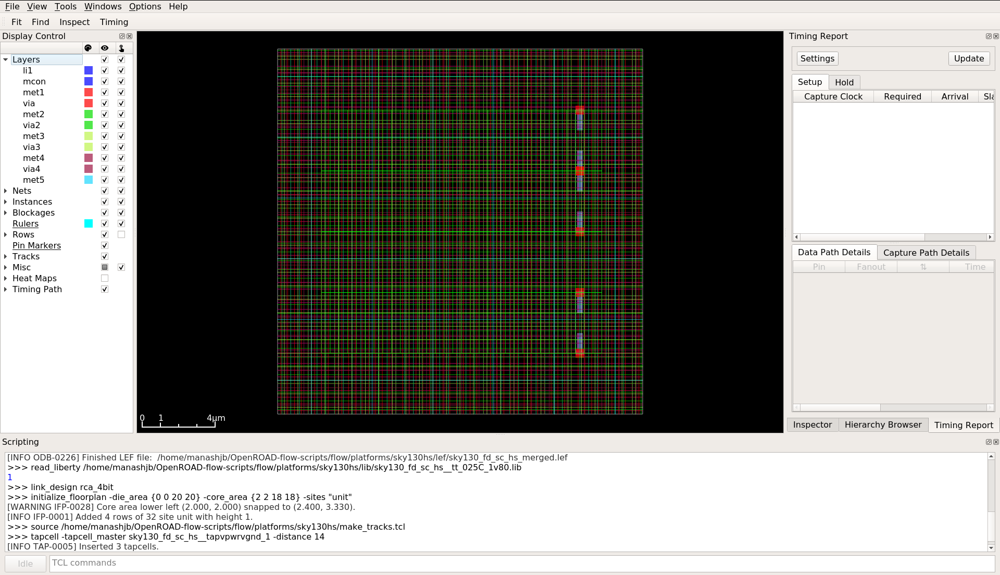<br>
Then Input and output pins were placed automatically along the core boundary with this command
```tcl
place_pins -hor_layers met3 -ver_layers met2
```
OpenROAD reported:
```
Number of available slots : 66
Number of IO pins         : 14
Estimated IO wirelength   : 187.04 µm
```
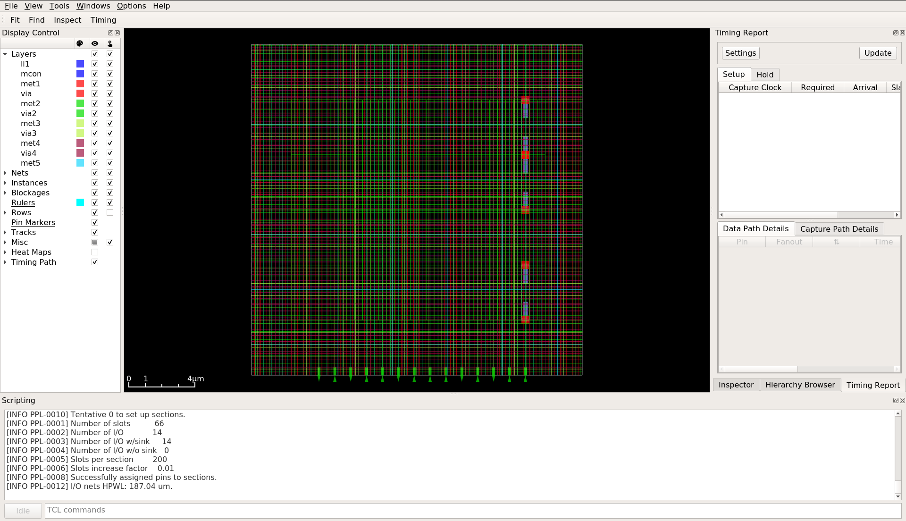<br>
Global Placement determines approximate positions of all movable standard cells inside the core area. The command for global placememt of the standard cells:
```tcl
global_placement -density 0.9
```
``-density 0.9`` specifies the target placement density, which indicates the maximum fraction of the core area that can be occupied by cells. 0.9 density means maximum allowed utilization is 90% where Core utilization = (standard cell area + macro cells area)/ total core area 

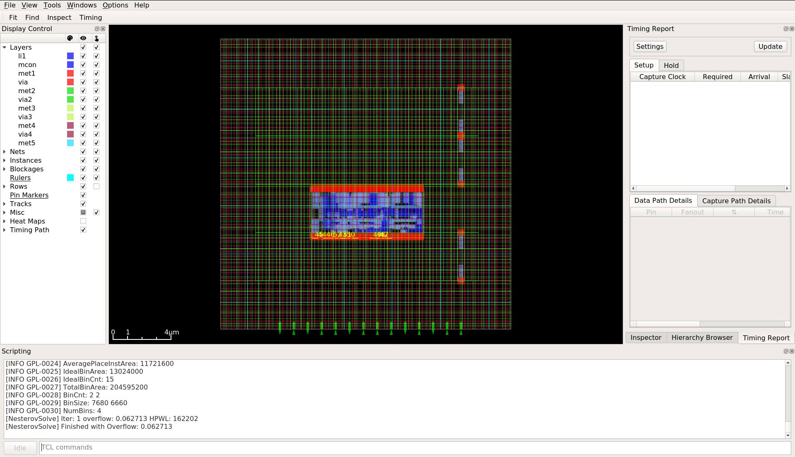<br>
After global placement, cells may overlap or may not align with legal placement rows. Detailed placement corrects these issues. Detailed placement ensures that cells align with placement sites, no cells overlap, placement rows are respected and design rules are satisfied. Command is:
```tcl
detailed_placement
```
Half-Perimeter Wirelength (HPWL) is the most widely used metric in VLSI physical design for estimating the total routing length of a net during the placement stage.
```HPWL = (max_x - min_x) + (max_y - min_y)```

**Lower HPWL → shorter wires → better design.**

From my placement and routing results:
| Stage     | HPWL     |
| --------- | -------- |
| Before detailed placing  | 162.7 µm |
| After detailed placing | 255.9 µm |

The HPWL increased slightly because after global placement, cells can be placed anywhere — even overlapping but after detailed placement, cells had to align with placement rows and overlaps were removed.

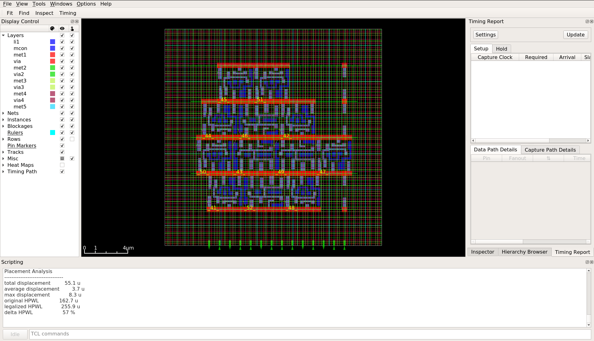<br>
Before moving to Routing, the tool must verify that every pin can be accessed by routing layers:
```tcl
pin_access
```
My Results:
| Parameter               | Value |
| ----------------------- | ----- |
| Pins analyzed           | 14    |
| Unique cell types       | 6     |
| Valid via access points | 66    |
| Pins without access     | 0     |

<br>
For this very small design, the OpenROAD global router occasionally fails due to limited routing tracks in the small core area. The detailed router was able to complete routing successfully without global routing guides. OpenROAD uses the TritonRoute router which can bypass the global route and can run detailed route directly. It the final physical design stage that creates metallic interconnections between standard cells, macros, and I/O pins based on a netlist. The command used is:
```tcl
detailed_route
```
My final routed layout has:

* 256 µm total wire length
* 80 vias
* 0 design rule violations

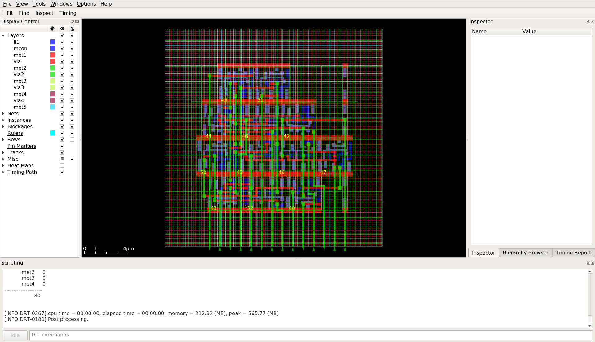<br>
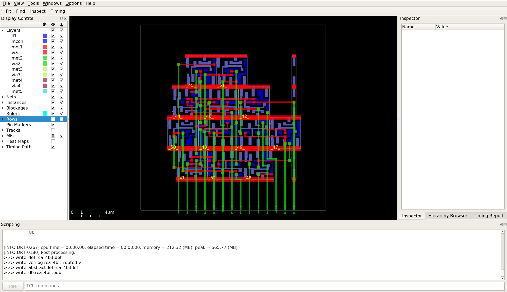<br>

## 6. DRC and LVS
* **Design Rule Check (DRC)**

DRC verifies that the layout follows the fabrication rules specified by the technology. It checks constraints such as minimum wire width, spacing, and enclosure to ensure the design can be manufactured reliably.

* **Layout Versus Schematic (LVS)**

LVS verifies that the generated layout matches the original schematic or synthesized netlist. It compares the extracted connections from the layout with the design netlist to ensure correct functionality and connectivity.

For DRC and LVS, Open source tools Magic and Netgen are used. First the layout is visualized in Magic VLSI from ``rca_4bit.def`` and .lef files from ``sky130_fd_sc_hs`` library. 

Magic VLSI is opened with SKY130 technology PDK using the commmand: 
```bash
magic -T /home/manashjb/EDA/open_pdks/sky130/sky130A/libs.tech/magic/sky130A.tech &
```
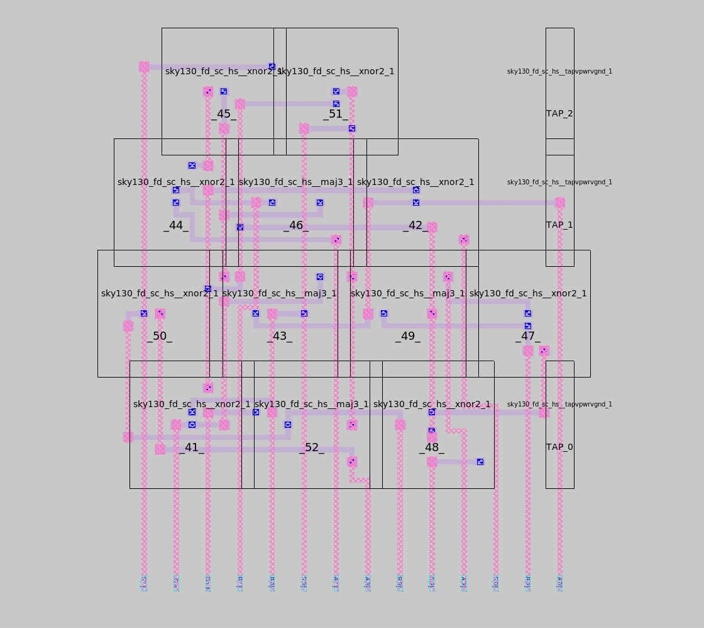<br>
The commands used in the Magic command terminal:
```tcl
lef read /home/manashjb/OpenROAD-flow-scripts/flow/platforms/sky130hs/lef/sky130_fd_sc_hs.tlef
lef read /home/manashjb/OpenROAD-flow-scripts/flow/platforms/sky130hs/lef/sky130_fd_sc_hs_merged.lef

def read ../floorplan/rca_4bit.def

drc check
drc count

extract all
ext2spice lvs
ext2spice
```
My design passed the DRC and I got 0 DRC errors.

After the commands ``ext2spice lvs`` and ``ext2spice``, a .spice netlist file is generated i.e. ``rca_4bit.spice`` which is used for LVS using the Netgen tool.
```bash
netgen -batch lvs "rca_4bit.spice rca_4bit" "../synth/rca_4bit_synth.v rca_4bit" /home/manashjb/EDA/open_pdks/sky130/sky130A/libs.tech/netgen/sky130A_setup.tcl lvs_report.log
```
This automatically does the LVS and generates a log report file. In my case it passed the LVS and my circuits are identical before and after the layout design.

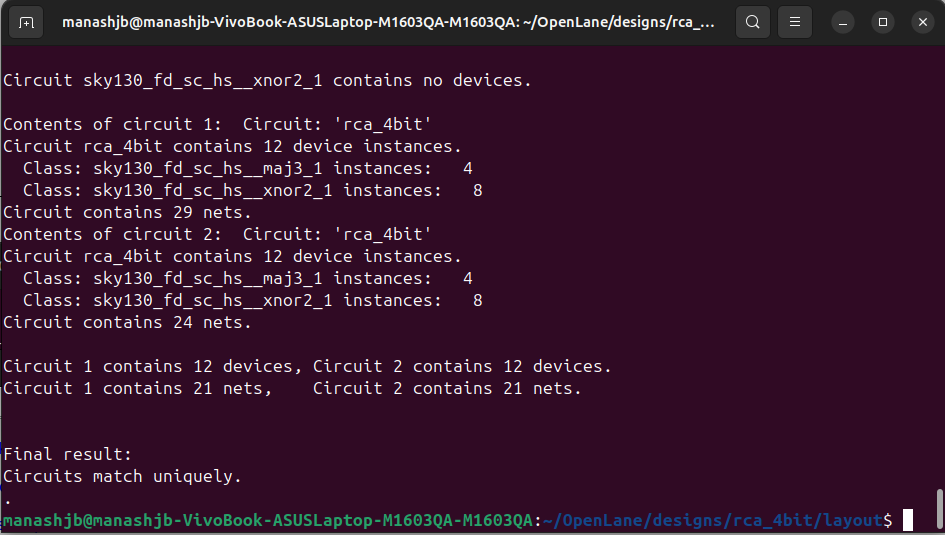<br>

## 7. GDSII Generation
For GDSII file, Magic tool is used again. Before writing the GDS file, the standard cell GDS library was loaded so that the abstract LEF views could be replaced with full transistor-level layouts. Then rca_4bit module is loaded and the command for generation of GDS file is passed:
```tcl
gds read sky130_fd_sc_hs.gds
load rca_4bit
gds write rca_4bit.gds
```
These commands generates the ``rca_4bit.gds`` GDSII file. This file is then opened and visulaized using Klayout tool:
